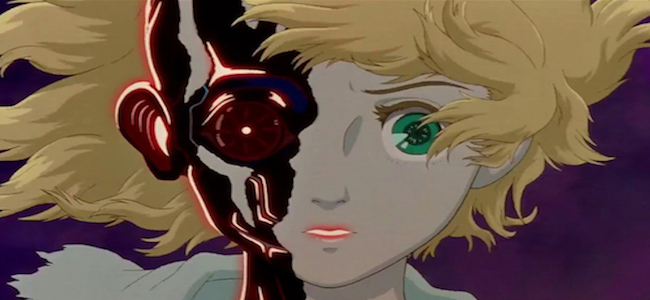
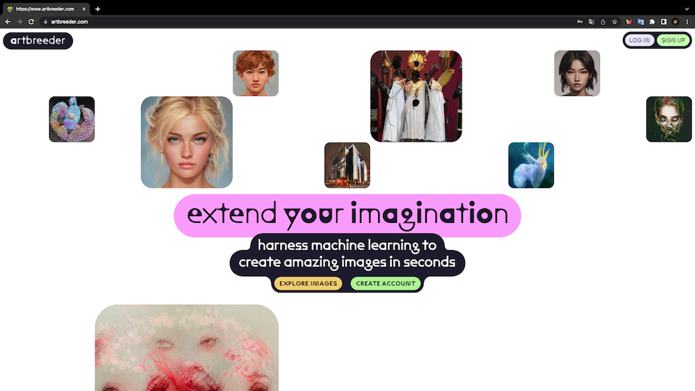
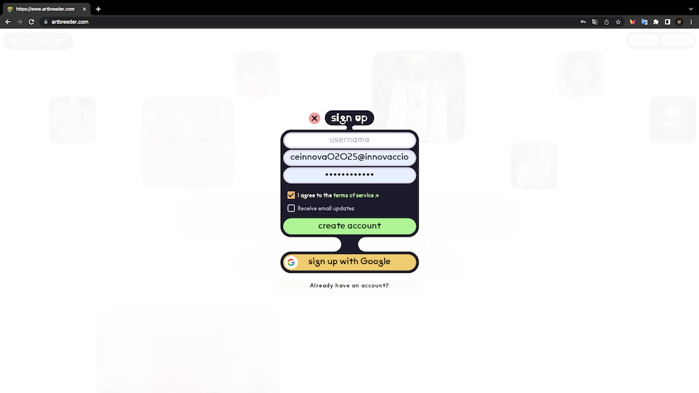
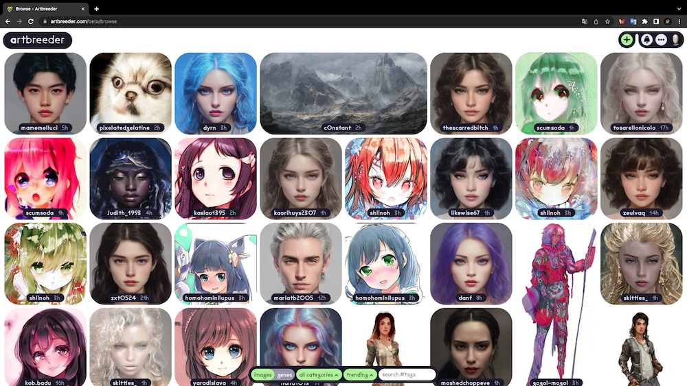
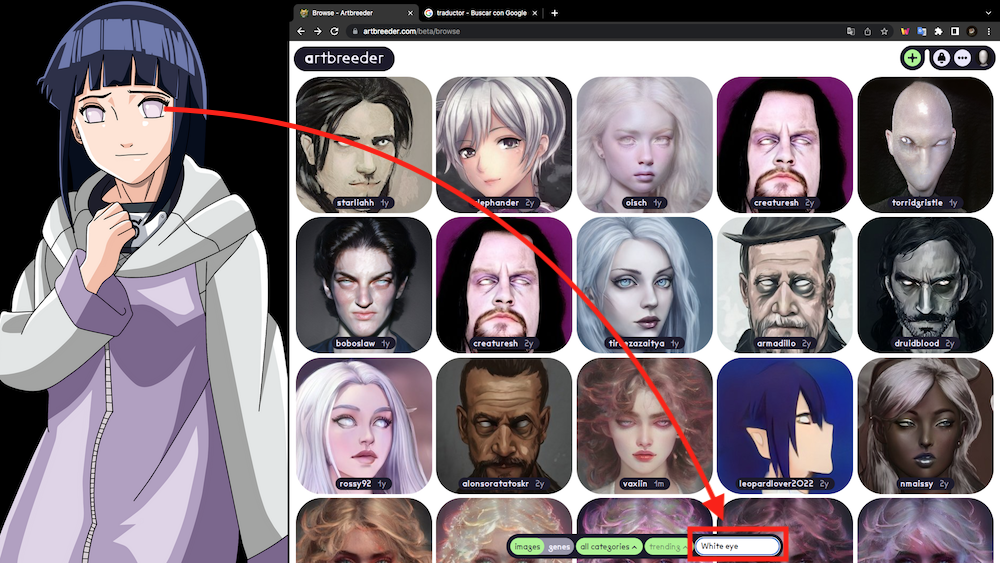
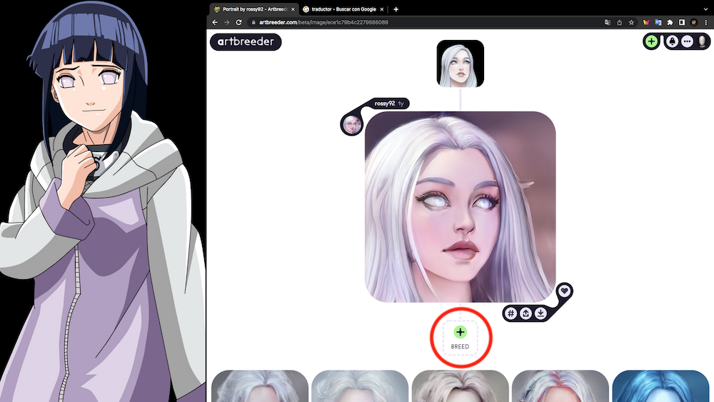
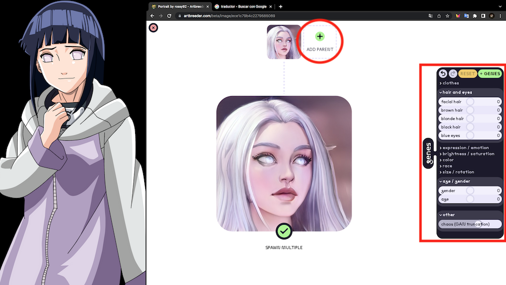
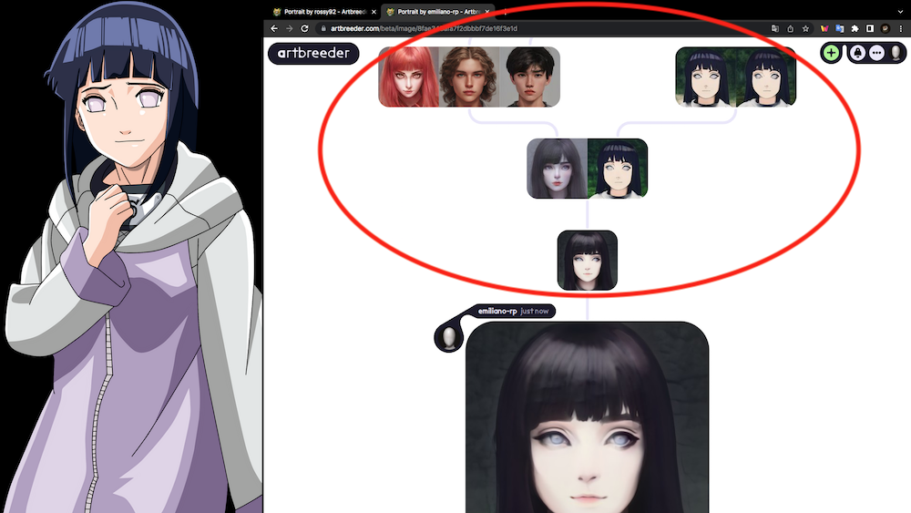
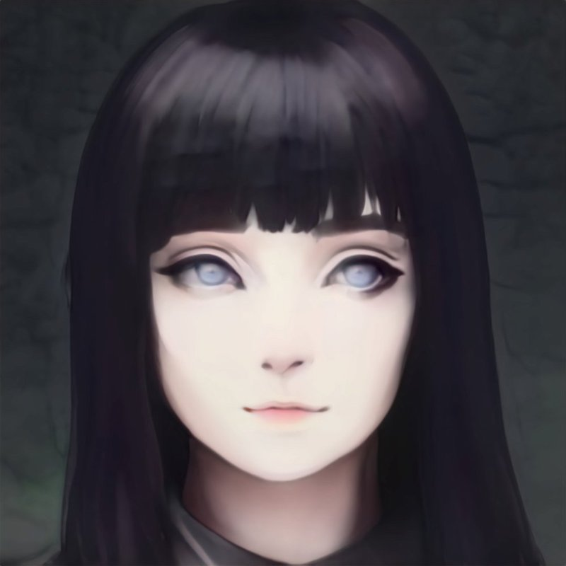

# Nivel 3. Introducción a la IA.

 

---
# Práctica 3. Cómo generar una imágen con inteligencia artificial (red generativa antagónica "*artbreeder*").

#### Por [Emiliano Rodríguez Pérez](https://github.com/Emiliano-RP) #IA Wizards
#### Sherpa: [José Jesús Guzmán Eusebio](https://github.com/josejesusguzman)
---
#### Requisitos:
- Tener un equipo de cómputo con Windows, Linux o MacOs.
- Tener conexión a internet.
---
#### Instrucciones:
1. Ingresar a la página de [Artbreeder](https://artbreeder.com/).

2. Debes de crear una cuenta de **Artbreeder**, o en su defecto iniciar sesión con **Google**.

3. Una vez iniciada sesión en **Artbreeder**, podremos visualizar una gran cantidad de imágenes con las que podemos empezar a generar nuestra propia imágen respectivamente. Sin embargo, el objetivo de está práctica es generar una imágen de un personaje de anime en 2D y convertirlo en un personaje 3D, por lo que procederemos a buscar una imagen de algún personaje 2D donde podamos ver sus rasgos faciales. 

En este caso daremos ejemplo con un personaje del anime **Naruto Shippuden** llamada **Hinata Hyuga**.

4. Para comenzar a recrear a nuestro personaje, se recomienda colocar la imagen del personaje de anime que descargamos en segundo plano en la pantalla de Artbreeder. Posteriormente en la de *"search # tags"* tendremos que buscar algunas características de nuestro personaje, en el ejemplo de Hinata Hyuga tiene los ojos blancos, por lo que necesitamos una imagen que tenga ojos blancos (la IA nos dará un mejor resultado de búsqueda si el texto lo introducimos en inglés).

5. Ya seleccionada una imágen que tenga la característica deseada, damos click en el botón de **"Breed"**.

6. En el aparatado de **"Add parent"**, podemos seguir agregando imágenes que tengan las caractaerísticas de nuestro personaje de anime, por ejemplo, el tipo de cabello de Hinata Hyuga es luz azul, por lo que podemos agregar una imagen que tenga cabello luz azul. También podemos modificar otros parámetros de la apariencia de nuestra creación(como la expresión o emoción que queremos que tenga la imágen) en el panel que se encuentra en la parte lateral derecha de la pantalla.

7. Podemos obtener resultados similiares a la realidad, gracias a la combinación de múltiples imágenes selecionadas.

8. Por último, podemos guardar la imagen generada en el aparatado de **"Image downloads"**.

# Fin.
---
#### Por [Emiliano Rodríguez Pérez](https://github.com/Emiliano-RP) #IA Wizards
- ##### Instagram: [@_emiliano_rp](https://www.instagram.com/_emiliano_rp/)
- ##### Facebook: [Emiliano Rodríguez Pérez](https://www.facebook.com/emiliano.rodriguezperez.94/)

---

